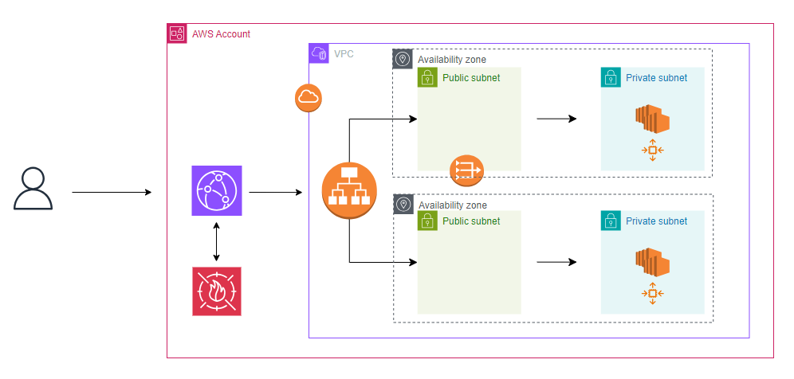

# A DDoS-resilient architecture for web applications

The purpose of this project is to deploy a robust, two-tier architecture in the AWS cloud capable of withstanding DDoS attacks at Layers 3,4 and 7 of the OSI model. The solution has been designed with the [AWS Best Practices for DDoS Resiliency](https://docs.aws.amazon.com/whitepapers/latest/aws-best-practices-ddos-resiliency/aws-best-practices-ddos-resiliency.html) in mind.

The components involved are the following:

* Virtual private cloud (VPC)
* Elastic compute cloud (EC2)
* Auto-scaling group (ASG)
* Application load balancer (ALB)
* Security groups
* CloudFront
* Web application firewall (WAF)
* Shield standard

## Prerequisites

Prior to the deployment of this solution, the 'Routes per route table' quota needs to be increased to the value of '60' so that the security groups can restrict access to CloudFront's managed prefix list.

## Architectural diagram


## Traffic flow

**1)** HTTP traffic is transmitted from the client to the CloudFront distribution which is the first point of entry into the infrastructure.

**2)** The WAF ACL attached to the CloudFront distribution inspects the inbound traffic. If allowed, WAF forwards the traffic to the ALB which only accepts traffic from CloudFront's managed prefix list.

**3)** The ALB forwards the traffic in a distributed manner to the healthy, backend EC2 instances which host the web application.

**4)** The web site is served to the client while CloudFront caches the served content.

## Mitigation techniques

This section aims at providing more detail on the mitigation techniques employed by each service involved, starting from the edge of the AWS network and working our way deep into the backend services that host the web application.

### CloudFront 

CloudFront is a content delivery network which is packed with a range of defensive mechanisms against DDoS attacks. Right out of the box, it can combat:

- Large volumetric attacks (i.e. UDP flood) thanks to its anycast routing and automated traffic engineering systems that can disperse the attack traffic amongst multiple edge locations.  
- SYN flood attacks due to its integration with the Shield TCP SYN proxy feature. The SYN proxy verifies each TCP three-way handshake it receives before passing them to the application. 

- It accepts only well formed HTTP connections so attacks such as Slowloris will not work.

The CloudFront distribution of this project has been configured with the additional mitigation measures:

- The CachingOptimized managed policy is enabled with the goal of  optimising cache efficiency.

- The Origin Shield feature is enabled as an additional layer of caching for a better cache hit ratio, reduced origin load and better network performance.

- Geo-restriction is enabled so that only a list of pre-approved, hardcoded countries can transmit requests to CloudFront.

### WAF

Attached to the CloudFront distribution is a WAF (Web Application Firewall) intended to provide protection against L7-based DDoS attacks (i.e. HTTP request flood). The web ACL of this project is configured with the following rules:

- A blanket rate limit rule with a threshold of 500 requests that applies to all inbound HTTP/HTTPs requests indiscriminately.

- A set of AWS managed rule groups.

### ALB

The ALB (Application Load Balancer) is a highly available service designed to distribute HTTP/HTTPs traffic across a target group based on the content of the request. In addition, the ALB is able to scale on demand in response to unanticipated spikes of traffic caused by flash crowds and DDoS attacks.

The ALB of this project is configured to listen only on the trusted traffic forwarded by CloudFront. This has been achieved by restricting the ALB's security group to allow only inbound traffic from the CloudFront distribution's managed prefix list. As a result, clients are not able to bypass CloudFront and send requests directly to the ALB.

Should you expect flash crowd traffic straight after deployment, or in the event where an imminent load test cannot be configured to gradually increase traffic, you can contact AWS Support and ask that they pre-warm the ALB as described [here](https://aws.amazon.com/articles/best-practices-in-evaluating-elastic-load-balancing/?sc_channel=sm&sc_campaign=Support&sc_publisher=TWITTER&sc_country=global&sc_geo=GLOBAL&sc_outcome=AWS%20Support&sc_content=Support&trk=Support&linkId=193246211#pre-warming).

## Usage
This code assumes that you have already Terraform installed locally. For instructions on how to install Terraform, please refer to Hashicorp's documentation [here](https://developer.hashicorp.com/terraform/install).

To deploy this solution, please follow the instructions below.

**1)** Clone the repository locally:

```
git clone https://github.com/nick22d/ddos-resilient-architecture-webapp.git
```

**2)** Navigate into the repository:

```
cd ddos-resilient-architecture-webapp/
```

**3)** Run the following commands in the order written:

```
terraform init
```

```
terraform apply --auto-approve
```

**4)** Verify functionality by browsing to the DNS name of the CloudFront distribution returned in the output with the command below:

```
curl $(terraform output -raw cloudfront_domain)  
```  